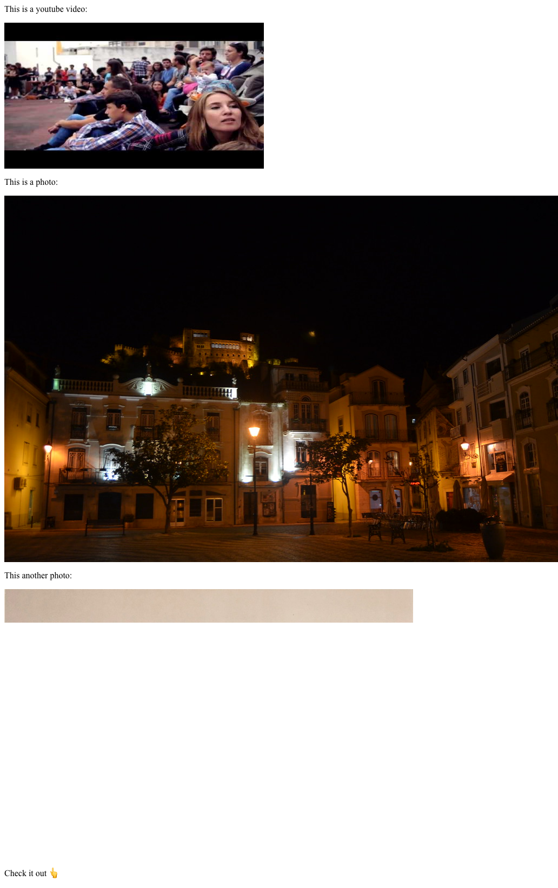
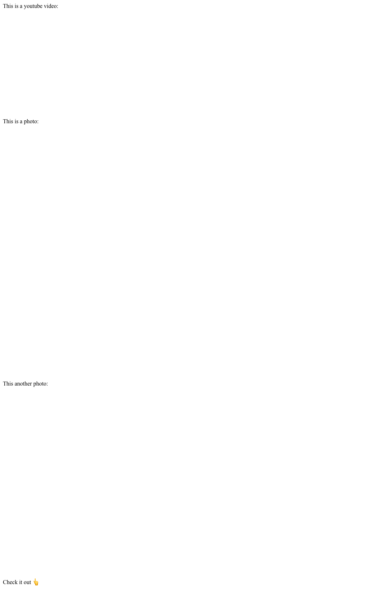

# remark-oembed

Converts URLs surrounded by newlines into embeds that are loaded asynchronously.

_For the most part, this code is taken directly from [agentofuser/remark-oembed](https://github.com/agentofuser/remark-oembed) 🙏_

## installation

```bash
yarn add @sergioramos/remark-oembed
```

## usage

Say we have the following markdown:

```markdown
This is a youtube video:

https://www.youtube.com/watch?v=aoLhACqJCUg

This is a photo:

https://www.flickr.com/photos/pedrocaetano/27432477888

This another photo:

http://www.23hq.com/mprove/photo/66422006

Check it out 👆
```

And our script looks as follows:

```javascript
const remark = require('remark');

remark()
  .use(require('@sergioramos/remark-oembed'))
  .use(require('remark-html'))
  .process(src, (err, file) => console.log(String(file)));
```

Now, running it yields:

```html
<p>This is a youtube video:</p>
<div id="oembed-random-id" class="remark-oembed-inline">
  <a
    href="https://www.youtube.com/watch?v=aoLhACqJCUg"
    rel="noopener noreferrer nofollow"
    target="_blank"
  >
    
  </a>
</div>
<template id="oembed-random-id-template">
  <iframe
    width="480"
    height="270"
    src="https://www.youtube.com/embed/aoLhACqJCUg?feature=oembed"
    frameborder="0"
    allow="accelerometer; autoplay; encrypted-media; gyroscope; picture-in-picture"
    allowfullscreen
  ></iframe>
</template>
<script async="true" defer="true">
  // ...
  document
    .getElementById('oembed-random-id')
    .attachShadow({ mode: 'closed' })
    .appendChild(
      document
        .getElementById('oembed-random-id-template')
        .content.cloneNode(true),
    );
  // ...
</script>
<p>This is a photo:</p>
<div id="oembed-random-id" class="remark-oembed-inline">
  <a
    href="https://www.flickr.com/photos/pedrocaetano/27432477888"
    rel="noopener noreferrer nofollow"
    target="_blank"
  >
    
  </a>
</div>
<template id="oembed-random-id-template">
  <a
    data-flickr-embed="true"
    href="https://www.flickr.com/photos/pedrocaetano/27432477888/"
    title="Leiria by night by Pedro Nuno Caetano, on Flickr"
  >
    
  </a>
  <script
    async
    src="https://embedr.flickr.com/assets/client-code.js"
    charset="utf-8"
  ></script>
</template>
<script async="true" defer="true">
  // ...
  document
    .getElementById('oembed-random-id')
    .attachShadow({ mode: 'closed' })
    .appendChild(
      document
        .getElementById('oembed-random-id-template')
        .content.cloneNode(true),
    );
  // ...
</script>
<p>This another photo:</p>
<a
  href="http://www.23hq.com/mprove/photo/66422006"
  rel="noopener noreferrer nofollow"
  target="_blank"
>
  
</a>
<p>Check it out 👆</p>
```

_before loading_:



### `syncWidget`

If you don't want to load the widget asynchronously and just default to how it would work in any other plugin, you can use `syncWidget`.

```javascript
remark()
  .use(require('@sergioramos/remark-oembed'), { syncWidget: true })
  .use(require('remark-html'))
  .process(src, (err, file) => console.log(String(file)));
```

```html
<div class="remark-oembed-inline">
  <iframe
    width="480"
    height="270"
    src="https://www.youtube.com/embed/aoLhACqJCUg?feature=oembed"
    frameborder="0"
    allow="accelerometer; autoplay; encrypted-media; gyroscope; picture-in-picture"
    allowfullscreen
  ></iframe>
</div>
```

As you can see above, it doesn't generate a preview `` neither a `<a />` to the source. Also, it doesn't try to replace the `` and the `<a />` with the `<iframe />`.

### `asyncImg`

Not only with `thumbnails`, but also with `oembed`'s `type === 'photo'`, you can make pictures also load asyncronously by setting `asyncImg`. This is accomplishing by generating an empty `base64` src with the same size as the original image:

```javascript
remark()
  .use(require('@sergioramos/remark-oembed'), { asyncImg: true })
  .use(require('remark-html'))
  .process(src, (err, file) => console.log(String(file)));
```

```html
<p>This is a youtube video:</p>
<div id="oembed-random-id" class="remark-oembed-inline">
  <a
    href="https://www.youtube.com/watch?v=aoLhACqJCUg"
    rel="noopener noreferrer nofollow"
    target="_blank"
  >
    
  </a>
</div>
<template id="oembed-random-id-template">
  <iframe
    width="480"
    height="270"
    src="https://www.youtube.com/embed/aoLhACqJCUg?feature=oembed"
    frameborder="0"
    allow="accelerometer; autoplay; encrypted-media; gyroscope; picture-in-picture"
    allowfullscreen
  ></iframe>
</template>
<script async="true" defer="true">
  // ...
  document
    .getElementById('oembed-random-id')
    .attachShadow({ mode: 'closed' })
    .appendChild(
      document
        .getElementById('oembed-random-id-template')
        .content.cloneNode(true),
    );
  // ...
</script>
<p>This is a photo:</p>
<div id="oembed-random-id" class="remark-oembed-inline">
  <a
    href="https://www.flickr.com/photos/pedrocaetano/27432477888"
    rel="noopener noreferrer nofollow"
    target="_blank"
  >
    
  </a>
</div>
<template id="oembed-random-id-template">
  <a
    data-flickr-embed="true"
    href="https://www.flickr.com/photos/pedrocaetano/27432477888/"
    title="Leiria by night by Pedro Nuno Caetano, on Flickr"
  >
    
  </a>
  <script
    async
    src="https://embedr.flickr.com/assets/client-code.js"
    charset="utf-8"
  ></script>
</template>
<script async="true" defer="true">
  // ...
  document
    .getElementById('oembed-random-id')
    .attachShadow({ mode: 'closed' })
    .appendChild(
      document
        .getElementById('oembed-random-id-template')
        .content.cloneNode(true),
    );
  // ...
</script>
<p>This another photo:</p>
<a
  href="http://www.23hq.com/mprove/photo/66422006"
  rel="noopener noreferrer nofollow"
  target="_blank"
>
  
</a>
<script async="true" defer="true">
  //...
  const img = document.getElementById('oembed-random-id');
  img.setAttribute('src', img.getAttribute('data-src'));
  //...
</script>
<p>Check it out 👆</p>
```

_before loading_:



### `useBlurHash`

You can accomplish the same as `asyncImg` but with a more advanced approach by using [blurhash](https://github.com/woltapp/blurhash). Instead of generating an empty base64 image, it generates a preview.

```javascript
remark()
  .use(require('@sergioramos/remark-oembed'), { useBlurHash: true })
  .use(require('remark-html'))
  .process(src, (err, file) => console.log(String(file)));
```

```html
<p>This is a youtube video:</p>
<div id="oembed-random-id" class="remark-oembed-inline">
  <a
    href="https://www.youtube.com/watch?v=aoLhACqJCUg"
    rel="noopener noreferrer nofollow"
    target="_blank"
  >
    
  </a>
</div>
<template id="oembed-random-id-template">
  <iframe
    width="480"
    height="270"
    src="https://www.youtube.com/embed/aoLhACqJCUg?feature=oembed"
    frameborder="0"
    allow="accelerometer; autoplay; encrypted-media; gyroscope; picture-in-picture"
    allowfullscreen
  ></iframe>
</template>
<script async="true" defer="true">
  // ...
  document
    .getElementById('oembed-random-id')
    .attachShadow({ mode: 'closed' })
    .appendChild(
      document
        .getElementById('oembed-random-id-template')
        .content.cloneNode(true),
    );
  // ...
</script>
<p>This is a photo:</p>
<div id="oembed-random-id" class="remark-oembed-inline">
  <a
    href="https://www.flickr.com/photos/pedrocaetano/27432477888/"
    rel="noopener noreferrer nofollow"
    target="_blank"
  >
    
  </a>
</div>
<template id="oembed-random-id-template">
  <a
    data-flickr-embed="true"
    href="https://www.flickr.com/photos/pedrocaetano/27432477888/"
    title="Leiria by night by Pedro Nuno Caetano, on Flickr"
  >
    
  </a>
  <script
    async
    src="https://embedr.flickr.com/assets/client-code.js"
    charset="utf-8"
  ></script>
</template>
<script async="true" defer="true">
  // ...
  document
    .getElementById('oembed-random-id')
    .attachShadow({ mode: 'closed' })
    .appendChild(
      document
        .getElementById('oembed-random-id-template')
        .content.cloneNode(true),
    );
  // ...
</script>
<p>This another photo:</p>
<a
  href="http://www.23hq.com/mprove/photo/66422006"
  rel="noopener noreferrer nofollow"
  target="_blank"
>
  
</a>
<script async="true" defer="true">
  // ...
  const img = document.getElementById('oembed-random-id');
  img.setAttribute('src', img.getAttribute('data-src'));
  // ...
</script>
<p>Check it out 👆</p>
```

_before loading_:


## license

BSD-3-Clause
